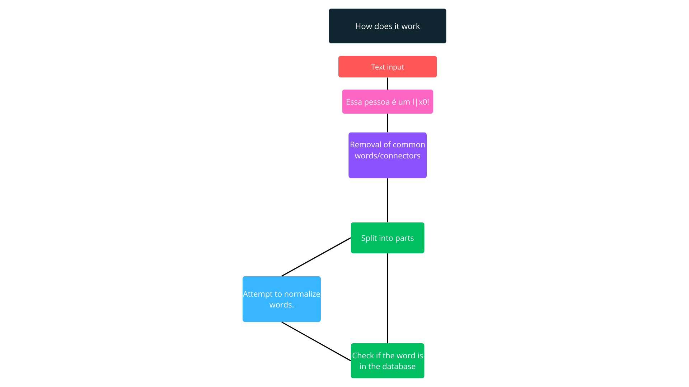

# Choose Language 🌐

<table border=1>
  <tr>
    <td><a href="https://github.com/JaymeFernandes/Detector_Ofensas/blob/main/Algorithm/README.md">English</a></td>
    <td><a href="https://github.com/JaymeFernandes/Detector_Ofensas/blob/main/Algorithm/README_pt.md">Português</a></td>
    <td><a href="https://github.com/JaymeFernandes/Detector_Ofensas/blob/main/Algorithm/README_es.md">Español</a></td>
  </tr>
</table>

# How does it work? 🧠

The algorithm works in a very simple way, going through 5 processes. 🔄

- Text input 📄
- Removal of common words/connectors ❌
- Split into parts ➗
- Create 2 versions of the word (attempting to normalize and normal). ✨
- Check if the word is in the database 📊

 
 

 

# Removal of common words/connectors ❌

The algorithm starts by removing common words or connectors such as "and", "but", "or", "for", "in", "to", etc.

This helps to reduce the number of checks at the end of the process. 🚀

 
 

<h3>Before ⏰</h3>
<pre>
  This person is an | 3x4mpl3!
</pre>

<h3>After ⏰</h3>
<pre>
  This person | 3x4mpl3
</pre>

 
 

### PT-BR:
<table border="1">
  <tr>
    <td>a</td>
    <td>o</td>
    <td>e</td>
    <td>é</td>
    <td>de</td>
    <td>do</td>
    <td>da</td>
    <td>dos</td>
    <td>das</td>
    <td>em</td>
    <td>na</td>
    <td>no</td>
    <td>nos</td>
    <td>nas</td>
    <td>um</td>
  </tr>
  <tr>
    <td>uma</td>
    <td>uns</td>
    <td>umas</td>
    <td>por</td>
    <td>para</td>
    <td>com</td>
    <td>como</td>
    <td>se</td>
    <td>mas</td>
    <td>mais</td>
    <td>menos</td>
    <td>ou</td>
    <td>ao</td>
    <td>aos</td>
    <td>à</td>
  </tr>
  <tr>
    <td>às</td>
    <td>onde</td>
    <td>quando</td>
    <td>porque</td>
    <td>que</td>
    <td>qual</td>
    <td>cujos</td>
    <td>cuja</td>
    <td>isto</td>
    <td>isso</td>
    <td>aquilo</td>
    <td>mesmo</td>
    <td>mesma</td>
    <td>mesmos</td>
    <td>mesmas</td>
  </tr>
  <tr>
    <td>também</td>
    <td>ainda</td>
    <td>muito</td>
    <td>muita</td>
    <td>muitos</td>
    <td>muitas</td>
    <td>ele</td>
    <td>ela</td>
    <td>eles</td>
    <td>elas</td>
    <td>você</td>
    <td>nós</td>
    <td>vossos</td>
    <td>vosso</td>
    <td>vos</td>
  </tr>
  <tr>
    <td>teu</td>
    <td>tua</td>
    <td>teus</td>
    <td>tuas</td>
    <td>meu</td>
    <td>minha</td>
    <td>meus</td>
    <td>minhas</td>
    <td>meus</td>
    <td>minhas</td>
    <td>seu</td>
    <td>sua</td>
    <td>suas</td>
  </tr>
</table>

### EN:
<table border="1">
  <tr>
    <td>and</td>
    <td>but</td>
    <td>or</td>
    <td>so</td>
    <td>yet</td>
    <td>for</td>
    <td>nor</td>
  </tr>
  <tr>
    <td>although</td>
    <td>however</td>
    <td>nevertheless</td>
    <td>therefore</td>
    <td>meanwhile</td>
    <td>consequently</td>
    <td>moreover</td>
  </tr>
  <tr>
    <td>furthermore</td>
    <td>likewise</td>
    <td>thus</td>
    <td>in</td>
    <td>otherwise</td>
    <td>as</td>
    <td>however</td>
  </tr>
  <tr>
    <td>the</td>
    <td>for</td>
    <td>to</td>
  </tr>
</table>

 
 

# Split into parts ➗

<pre>
  This person | 3x4mpl3
</pre>

<table border="1">
  <tr>
    <td>This</td>
    <td>person</td>
    <td>example</td>
  </tr>
</table>

 

# Create 2 versions of the word (attempting to normalize and normal). ✨

The algorithm takes the most common ways people replace characters of texts with symbols. 🔎

<h3>Normal</h3>
<pre>
  This person | 3x4mpl3
</pre>

<h3>Normalized</h3>
<pre>
  This person example
</pre>

 
<table border="1">
  <tr>
    <th>Character</th>
    <th>Correspondence</th>
  </tr>
  <tr>
    <td>4</td>
    <td>a</td>
  </tr>
  <tr>
    <td>@</td>
    <td>a</td>
  </tr>
  <tr>
    <td>8</td>
    <td>b</td>
  </tr>
  <tr>
    <td>(</td>
    <td>c</td>
  </tr>
  <tr>
    <td>3</td>
    <td>e</td>
  </tr>
  <tr>
    <td>€</td>
    <td>e</td>
  </tr>
  <tr>
    <td>9</td>
    <td>g</td>
  </tr>
  <tr>
    <td>6</td>
    <td>g</td>
  </tr>
  <tr>
    <td>#</td>
    <td>h</td>
  </tr>
  <tr>
    <td>1</td>
    <td>i</td>
  </tr>
  <tr>
    <td>!</td>
    <td>i</td>
  </tr>
  <tr>
    <td>|</td>
    <td>l</td>
  </tr>
  <tr>
    <td>Й</td>
    <td>n</td>
  </tr>
  <tr>
    <td>0</td>
    <td>o</td>
  </tr>
  <tr>
    <td>*</td>
    <td>o</td>
  </tr>
  <tr>
    <td>5</td>
    <td>s</td>
  </tr>
  <tr>
    <td>$</td>
    <td>s</td>
  </tr>
  <tr>
    <td>7</td>
    <td>t</td>
  </tr>
  <tr>
    <td>+</td>
    <td>T</td>
  </tr>
  <tr>
    <td>2</td>
    <td>z</td>
  </tr>
  <tr>
    <td>%</td>
    <td>z</td>
  </tr>
</table>

 
 

# Check if the word is in the database 📊

Finally, it checks for similarity between any word in the database and the received words (normalized and normal).

Using 2 algorithms:

-  Jaro-Winkler
-  Levenstein